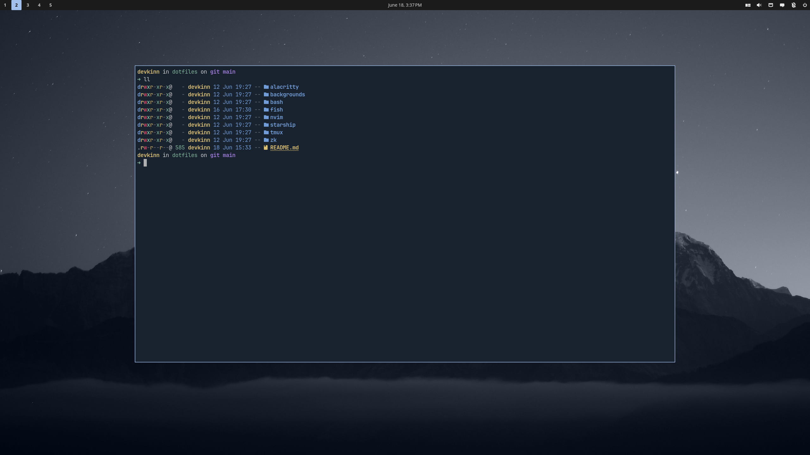

# dotfiles

This repository contains my configuration for Linux. I try to keep my dotfiles as minimal as possible to avoid extensive management and focus on the actual work.

 

## Installation/management

My dotfiles are managed with GNU stow. All you have to do is install it with your package manager and clone this repo:

```bash
git clone https://github.com/devkinn/dotfiles.git
```

Then run the stow command to create a symlinked directory for a specific package. For example:

```bash
stow nvim
```

This deploys Neovim configuration files to `$HOME/.config/nvim`. The target directory is dependant on directory structure inside the repo.

> [!NOTE]
> You have to clone this repository into `$HOME` because of how stow works.

## Current setup (Linux)

### Desktop environment

Cosmic DE - simple and easy to configure with builtin window tiling support. Gets the job done.

### Shell

For interactive use - fish with [z](https://github.com/jethrokuan/z) and [fzf](https://github.com/PatrickF1/fzf.fish) plugins. For scripting - bash.

### Terminal

Alacritty - fast and simple.

### Editor - Neovim

I just use [LazyVim](https://www.lazyvim.org/) and enable all the extras I need. The only custom config I have is for note taking with [zk-nvim](https://github.com/zk-org/zk-nvim).

## Additional tools

These are the additional tools that i use in my workflow:

- [starship.rs](https://starship.rs/) - contextual prompt
- [tmux](https://github.com/tmux/tmux) - terminal multiplexer
- [lazygit](https://github.com/jesseduffield/lazygit) - easier repository management
- [zk](https://github.com/zk-org/zk) - CLI note taking tool
- [eza](https://github.com/eza-community/eza) - modern ls alternative
- [bat](https://github.com/sharkdp/bat) - modern cat alternative
